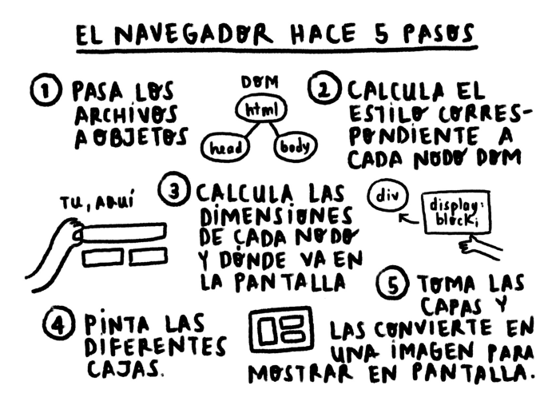
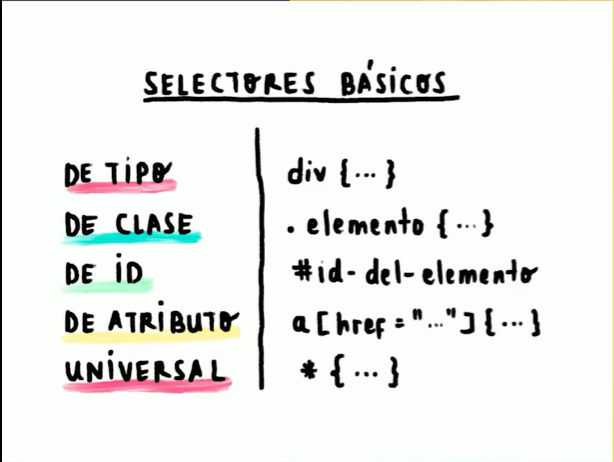
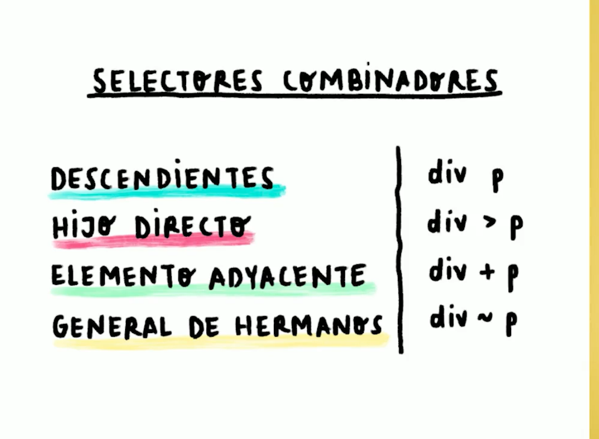
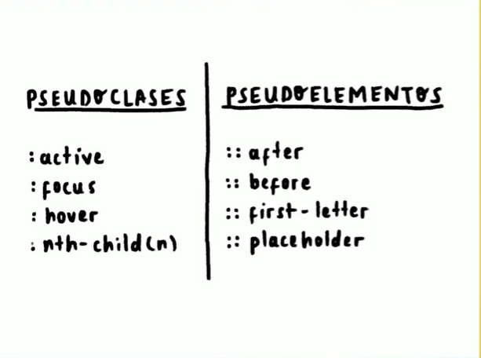

## **FRONTEND**

#### **Motores Render**
Encargados de pasar los archivos a pixeles.


### **HTML SEMANTICO**
Si bien es cierto hay etiquetas que funcionan o renderizan en pantalla , lo que uno quiere representar, pero a nivel de **`significado`**  es diferente . Representan graficamente lo mismo `pero tienen un significado distinto, el cual lo entiende el navegador(SEO)`

- Evitar los DIV, estos no tienen significado.
### **SELECTORES**




### **PSEUDOCLASES | PSEUDOELEMENTOS**
Existen otros selectores ademas de selectores basicos y combinados, capases de cambiar un estado o añadir algo:

**PSEUDOCLASES ( : )**

Definen **`el estilo de un estado`** de un elemento (sobre poner el mause,visitado,activo,hacer click).

`Gracias a la Pseudoclase podemos cambiar el estilo de algun elemento cunado sucede algo.`
```
button:hover{
    color : Orange;
}

button:active {
    color: #1557ad;
}
```

**PSEUDOELEMNTOS ( :: )**

`Podemos definirlos como elementos que escribimos desde CSS`, por ejemplo el ::after y ::before

```
p::before {
    content: "✨";
}
```

Tambien podemos realizar combinaciones entre pseudoclases y pseudoelementos.
```
p::before {
    content: "✨";
}

p:hover::before {
    content: "💅";
}
```


