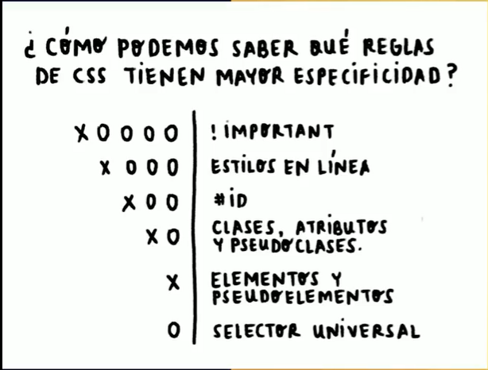
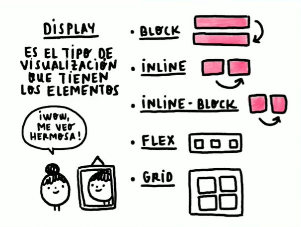

## **FRONTEND**

#### **Motores Render**
Encargados de pasar los archivos a pixeles.


### **HTML SEMANTICO**
Si bien es cierto hay etiquetas que funcionan o renderizan en pantalla , lo que uno quiere representar, pero a nivel de **`significado`**  es diferente . Representan graficamente lo mismo `pero tienen un significado distinto, el cual lo entiende el navegador(SEO)`

- Evitar los DIV, estos no tienen significado.
### **SELECTORES**


### **PSEUDOCLASES | PSEUDOELEMENTOS**
Existen otros selectores ademas de selectores basicos y combinados, capases de cambiar un estado o añadir algo:

**PSEUDOCLASES ( : )**

Definen **`el estilo de un estado`** de un elemento (sobre poner el mause,visitado,activo,hacer click).

`Gracias a la Pseudoclase podemos cambiar el estilo de algun elemento cunado sucede algo.`
```
button:hover{
    color : Orange;
}

button:active {
    color: #1557ad;
}
```

**PSEUDOELEMNTOS ( :: )**

`Podemos definirlos como elementos que escribimos desde CSS`, por ejemplo el ::after y ::before

```
p::before {
    content: "✨";
}
```

Tambien podemos realizar combinaciones entre pseudoclases y pseudoelementos.
```
p::before {
    content: "✨";
}

p:hover::before {
    content: "💅";
}
```


### **CASCADA Y ESPECIFICIDAD**

### **CASCADA**
El orden de las instrucciones en CSS importan.
### **ESPECIFICIDAD**
Es la manera como el navegado lidia con los conflictos en un archivo CSS.
`"Entre > especificidad, > es la posibilidad de que sus declaraciones se usen sobre las demas."`


Básicamente, CSS acabará aplicándole los estilos al selector que sea más específico, y podemos determinar su especificidad simplemente haciendo una suma


```
<head>
    
    <style>
        #platzi{
            color: red;
        }

        .master{
            color blue;
        }
    </style>
</head>
<body>
    <div id="plazi" class="master"> Platzi </div>
</body>

/*Como resultado el elemento tomara el color rojo, devido a que el ID tiene > especificidad.*/
```
### **DISPLAY MAS USADOS : BLOACK, INLINE E INLINE BLOCK**


Entender estos tipos de displays es muy importante, ya que a veces estamos tratando de añadirle márgenes a algunos elemenos y por alguna extraña razón no funciona. Pero es sencillo:

***Block:*** `Estos elementos ocupan toda la pantalla`, por lo que si quieres agregar otro elemento, este se agregará automáticamente abajo. No importa que tengas poco contenido, el elemento sí o sí va a ocupar toda la pantalla.
Podemos establecerle un `width, height, margin`

**Inline:** ` Estos elementos son los que su caja mide exactamente lo mismo que su contenido`. Estos elementos los podemos usar en textos y en lugar de que se agreguen en una nueva línea se agregaran justo al ladito del texto. ❗ Tienen como desventaja que no podemos ponerles márgenes ni tampoco podemos cambiar su tamaño.
`Hacen caso omiso cuando se añade un width, height o margin`

**Inline-block:**  `Esto mezcla lo mejor de ambos mundos`. `Podemos tener elementos que no ocupen todo el ancho de la pantalla, sino que ocupen solamente lo que su contenido ocupa`, `pero también vamos a poder darle márgenes y podremos cambiar su tamaño`


### **Flex**
Flexbox es magia, con Flexbox podemos literal manipular los elementos a como queramos. ¿Alguna vez has visto el meme de "programadores sufriendo por centrar un div"? Pues Flexbox rompe ese meme de manera épica 😎. . Con Flexbox podemos alinear los elementos a como queramos, así lo queramos a la izquierda, en el centro o a la derecha, tanto vertical como horizontalmente

- [Documentción](https://css-tricks.com/snippets/css/a-guide-to-flexbox/)

- [Juego para Practicar](https://flexboxfroggy.com/#es)

### **Grid**
Grid consiste en el ordenamiento de elementos hijos en dos ejes, como si fuera una cuadrícula o tabla

- [Documentción](https://css-tricks.com/snippets/css/complete-guide-grid/)
```
<!DOCTYPE html>
<html lang="en">
<head>
    <meta charset="UTF-8">
    <meta name="viewport" content="width=
    , initial-scale=1.0">
    <title>Document</title>
    <style>
        .container{
            display: grid;
            background: papayawhip;
            height: 400px;
            width: 400px;
            grid-template-columns: 1fr 1fr 1fr 1fr;
            grid-template-rows: 1fr 1fr 1fr 1fr;
        }
        .item{
            background: pink;
        }
        //ubicación de elementos
        .container .item:nth-child(1){
            grid-column: 1/2;
        }
        .container .item:nth-child(2){
            grid-column: 2/3;
            grid-row: 2;
        }
        .container .item:nth-child(3){
            grid-column: 3/4;
            grid-row: 3;
        }

        .container .item:nth-child(4){
            grid-column: 4/5;
            grid-row: 4;
        }
    </style>
</head>
<body>
    <div class="container">
        <div class="item"></div>
        <div class="item"></div>
        <div class="item"></div>
        <div class="item"></div>
    </div>
</body>
</html>
```

